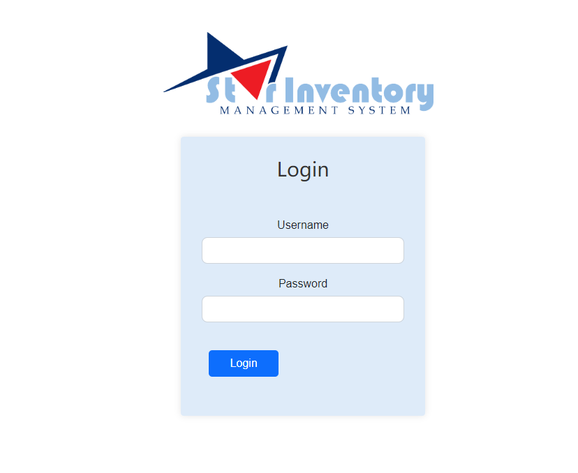
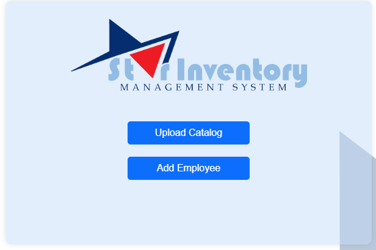
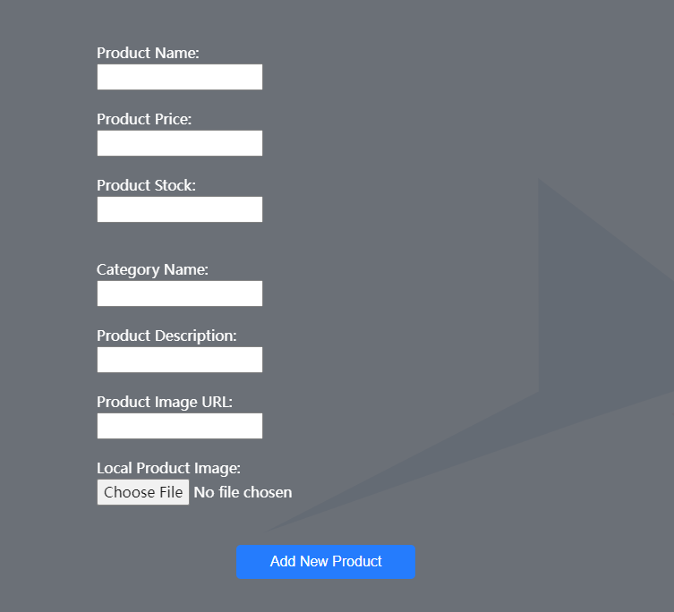
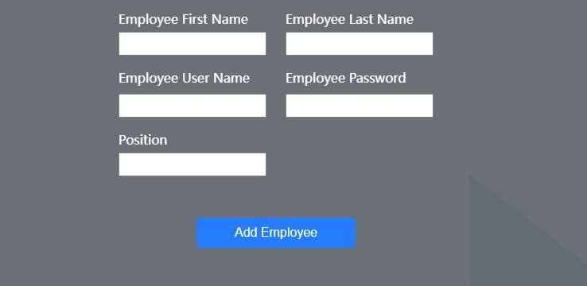

<a id="readme-top"></a>


<div align="center">
  <a href="https://github.com/Rafflafressia/Star-Inventory-Logistics">
    
  </a>

  <h3 align="center">Star Inventory Logistics</h3>

  <p align="center">
   This project is a light Inventory and Product Management System that allows managers to manage products and users, and users to view and sell products.
    <br />
    <a href="https://github.com/Rafflafressia/Star-Inventory-Logistics"><strong>Click here for Github Repo  »</strong></a>
    <br />
    <br />
    <a href="">Deployed Demo</a>
    ·
    <a href="https://github.com/Rafflafressia/Star-Inventory-Logistics/issues">Report Bug</a>
    ·
    <a href="https://github.com/Rafflafressia/Star-Inventory-Logistics/issues">Request Feature</a>
  </p>
</div>

<!-- TABLE OF CONTENTS -->
<details>
  <summary>Navigation of Contents</summary>
  <ol>
    <li>
      <a href="#about-the-project">About The Project</a>
      <ul>
        <li><a href="#built-with">Built With</a></li>
      </ul>
    </li>
    <li>
      <a href="#getting-started">Getting Started</a>
      <ul>
        <li><a href="#prerequisites">Prerequisites</a></li>
        <li><a href="#installation">Installation</a></li>
      </ul>
    </li>
    <li><a href="#usage">Usage</a></li>
    <li><a href="#contact">Contact</a></li>
    <li><a href="#future_additions">Future Additions</a></li>
    <li><a href="#reference">Reference</a></li>
  </ol>
</details>

<a id="#about-the-project"></a>
## About The Project

<p><strong>Start Page</strong></p>





<br />

This is the login page for manager and salesperson to login the inventory management system.


<a id="#built-with"></a>
## Built with
This generator is made with Javascript.

* 
* 
* 
* 
* 

<p align="right">(<a href="#readme-top">back to top</a>)</p>

<a id="getting_started"></a>
## Getting Started

This is an example of how you may give instructions on setting up your project locally.
To get a local copy up and running follow these simple example steps.

<a id="prerequisities"></a>
### Prerequisites

You should have your shell ready for downloading this project. We use gitbash as an example in this project

<a id="installation"></a>
### Installation
1. Get a free API Key at [github](https://github.com/Rafflafressia/Star-Inventory-Logistics#built-with)
2. Clone the repo
   ```sh
   git clone https://github.com/Rafflafressia/Star-Inventory-Logistics.git
   ```

3. In your terminal, input `npm start` to start the server.


<p align="right">(<a href="#readme-top">back to top</a>)</p>


<a id="usage"></a>
## Usage

When you input `npm start` In your terminal to start the server, you could send request to server to login, logout, create a product,create information for an employee, get information about single product, search product by keywords and etc.

For more details, please refer to the [Documentation](https://github.com/Rafflafressia/Star-Inventory-Logistics)

## Demo

#### Login Page:

Show the login page.
Enter credentials to login as a manager or salesperson.


#### Manager Page:

Show the manager dashboard.




Create products.


Create a new user 


#### Salesperson Page:

Show the user dashboard.
View assigned products


<p align="right">(<a href="#readme-top">back to top</a>)</p>

## Features

1. **Category and Products:** The system allows the creation of categories, each containing a list of products.

2. **Login Page:** Users can log in with their username and password.

3. **Role-based Access:** Depending on the user's role (manager or user), they are directed to the appropriate page:
   - Managers are directed to the manager page, where they can create users and manage products.
   - Users are directed to the user page, where they can view products and manage their sales.

4. **User Creation:** Only managers have the ability to create new users.

5. **Product Assignment:** Managers can assign products to users for them to sell.

<p align="right">(<a href="#readme-top">back to top</a>)</p>

<a id="future_additions"></a>
## Future Additions
* The ability to render a formal quote pdf that can be emailed to clients (via Nodemailer)
* The ability to render a full catalogue that can be emailed to clients (via Nodemailer)
* Save image in other online storage (Cloudinary) rather than the server
* A desktop application that doesn’t require network and can be accessed locally (via Electron npm package) 


<p align="right">(<a href="#readme-top">back to top</a>)</p>


<a id="contact"></a>
## Contact


Arkaw Banerjee - [Email]
Bahman Dorandish - [Email]
Mohnish Bhujun - [Email]
Shuai(Jason) Gu - [Email](king.gs1314@outlook.com) - king.gs1314@outlook.com

Project Link: [https://github.com/Rafflafressia/Star-Inventory-Logistics](https://github.com/Rafflafressia/Star-Inventory-Logistics)

<p align="right">(<a href="#readme-top">back to top</a>)</p>

<a id="reference"></a>
## Reference
* Xpert Assistant/ChatGPT
* https://dev.to/envoy_/150-badges-for-github-pnk#games
* https://github.com/othneildrew/Best-README-Template


<p align="right">(<a href="#readme-top">back to top</a>)</p>

<!-- MARKDOWN LINKS & IMAGES -->
<!-- https://www.markdownguide.org/basic-syntax/#reference-style-links -->
[Javascript-url]:https://img.shields.io/badge/JavaScript-F7DF1E?style=for-the-badge&logo=javascript&logoColor=black


